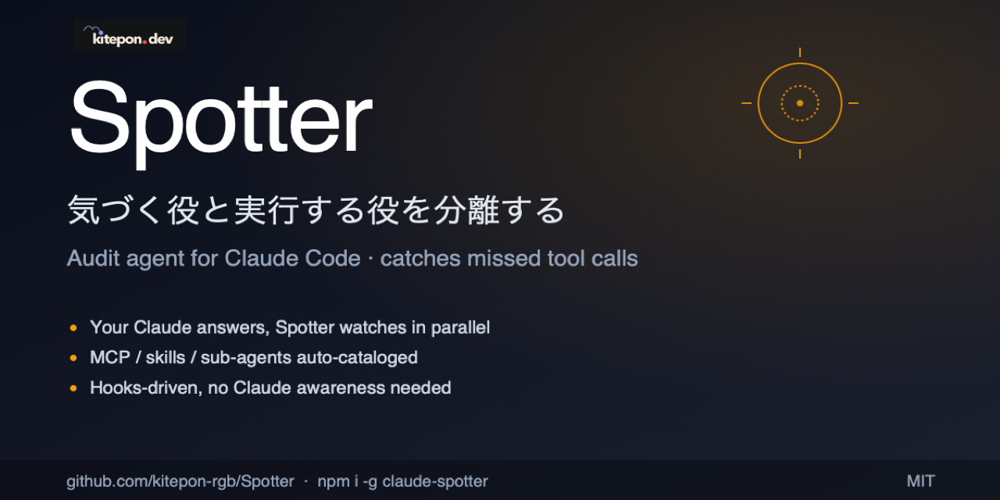
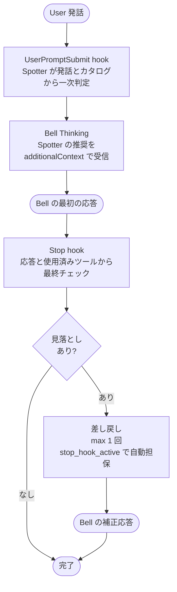
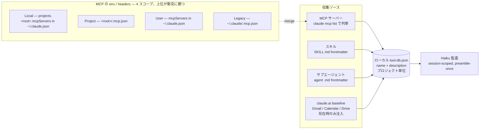

<p align="center">
  
</p>

# Spotter

[](https://www.npmjs.com/package/claude-spotter)
[](https://github.com/kitepon-rgb/Spotter/actions/workflows/ci.yml)
[](https://nodejs.org)
[](LICENSE)

**[English](README.md) · 日本語**

> **気づく役と実行する役を分離する。** Claude Code の横で並走し、Bell (主役の Claude) が**ツールを呼び忘れたとき**だけ静かに指摘する監査役。

Claude には「使えるツールがあるのに、使うべきタイミングで使わない」という構造的な弱点があります。記録すべき決定を memory / caveat MCP に残さない、docs lookup MCP を呼ばずに古い知識で応答する、ブラウザ自動化 MCP で確認せず UI 状態を推測する — **「分からないと自覚できない」から、ツールを取りに行けない**。

Spotter はツールカタログを完全に把握した別エージェント (Claude Haiku 4.5) をセッション毎に常駐させ、Bell の発話予定と応答を並走監査します。見落としを検出すると透明化された指摘として Bell に届け、補正応答を促します。**Bell が自覚して呼ぶ**設計は本プロダクトの存在意義を破壊するため、Bell から呼ぶのではなく hook 経由で Bell の意思と独立に検出する構造を取っています。

## 30 秒で見るポイント

Spotter が拾うのは、たとえばこういう瞬間です。

| 状況 | Bell の応答 | Spotter の指摘 |
|---|---|---|
| 「この OAuth の落とし穴を覚えて」 | 了解だけして進める | memory / caveat MCP の使用機会 |
| 「このパッケージの最新版 API は？」 | 学習時点の知識で答える | docs lookup MCP の照会機会 |
| 「この危ない patch をレビューして」 | 自分だけで見直す | reviewer sub-agent の使用機会 |
| 事実の断定 | 裏付けなしで「〜です」 | 検証用ツールの差し込み余地 |
| 「この UI 今もちゃんと動く？」 | コード読みだけで結論 | ブラウザ自動化 MCP の使用機会 |
| 「以前何を決めたっけ？」 | 推測 / 失念のまま回答 | メモリ / ノート系 MCP の照会機会 |

判定軸は 2 段階:

- **入力時 (`stage=user_input`)**: ユーザー要請に対し、ローカルカタログの description から用途が明確に該当するツールを列挙する **要請充足チェック**
- **応答後 (`stage=turn_end`)**: Bell の最終応答に対し、事実の断定 / 記録すべき新情報 / 既知情報の参照それぞれに、カタログ上のツール (検証 / 登録 / 照会) を差し込める余地がないかを問う **ツール適用機会の監査**

## インストール

```bash
npm install -g claude-spotter
cd your-project
spotter install
```

`v0.3.0` 以降は**プロジェクト単位の明示的 install** を採用しています (v0.2 までの `postinstall` 自動登録はデーモン増殖の主因だったため撤回)。各プロジェクトの `.claude/settings.json` に hook を登録し、そのプロジェクトでの Claude Code セッションのみで有効になります。

Spotter を upgrade した後、release note で hook 設定変更が案内されている場合は、各 install 済みプロジェクトで `spotter install` を再実行してください。global package update でコード経路は変わりますが、既存 `.claude/settings.json` の timeout 値は自動では書き換わりません。

```bash
spotter uninstall        # このプロジェクトの hook 登録を解除
```

## 動作要件

- **Node.js 22.5 以上**
- **Claude Code 2.0 以上**
- **現行 Claude-backed auditor path では Claude Max プラン** (`claude -p` で Haiku を起動するため)

## アーキテクチャ

### 1 ターンの監査フロー



### カタログの収集経路



監査対象のツール (name + description) は `<project>/.spotter/tool-db.json` (ローカル) に格納されます。**daemon が監査に使うのはローカル DB のみ**で、グローバル DB `~/.spotter/tool-db.json` は他プロジェクトでの description 再利用キャッシュとしてのみ機能します (live fetch コスト削減のため初回 refresh で参照、結果は local に write-through)。各プロジェクトの local DB は **そのプロジェクトの現時点の discovery 結果と一致** (refresh 時に prune される) ため、過去にインストールしていた MCP / スキル / サブエージェントが他プロジェクトに混入することはありません。

**`spotter install` が初回 seed を自動実行し、Claude Code セッション起動ごとに SessionStart hook が bg で `spotter db refresh` を走らせる**ため、通常の運用で手動コマンドを叩く必要はありません。各 MCP サーバーの `tools/list` は JSON-RPC で取得 (HTTP / SSE / stdio transport 対応)、スキルとサブエージェントは frontmatter から直接抽出、claude.ai baseline (OAuth proxy 経由の Gmail / Calendar / Drive 25 件) は `claude mcp list` に該当サーバーが存在する環境でのみ注入されます。**手書きでツールリストを管理する必要はありません**。

## Throughline との関係

[Throughline](https://github.com/kitepon-rgb/Throughline) と Spotter は同じ作者が作った、**哲学を共有する別プロダクト**です。

|  | Throughline | Spotter |
|---|---|---|
| 思想 | 引き算 (要らないものを退避) | 足し算 (足りない動作に気づかせる) |
| 対象 | コンテキスト肥大化 | ツール取りこぼし |
| 仕組み | hook で記憶退避 | hook でサブエージェント並走 |

両者に共通するのは **「主体 (Bell) に頼らない仕組み」**。併用できます。

## よく使うコマンド

```bash
spotter db list          # 現在のローカル tool-db (daemon が実際に audit に使う) を表示
spotter db refresh       # MCP / スキル / サブエージェントから description を収集して DB 更新
                         # (v1.1.0 以降、install 時と SessionStart 時に自動実行されるので通常は不要)
spotter db rebuild       # local + global DB を両方消してから refresh (カタログ設計変更時のクリーン用)
spotter status           # 稼働中の daemon 一覧
spotter doctor           # 環境診断 (Node / claude CLI / tool-db 整合性)
spotter diagnostics logs # daemon log から pass=false / latency / anomaly signal を集計
spotter codex risk-check --findings findings.json --host-agent claude
                         # Spotter finding を codex-sidecar に渡して read-only risk analysis
spotter codex review|explore|opinion --findings findings.json --host-agent claude
                         # その他の read-only codex-sidecar second-pass workflow
spotter codex work --findings findings.json --instruction "docs 更新" --approve-work \
  --allowed-path docs/ --preserve-worktree
                         # 承認済み codex-sidecar work を isolated worktree で実行
spotter uninstall        # hook 登録を解除 (~/.spotter は残す)
```

Codex risk dispatch を daemon から非同期に流す場合:

```bash
SPOTTER_CODEX_RISK_CHECK=1 spotter daemon start --session-id ... --project-root ...
```

有効時は daemon が `pass:false` finding を detached process の
`spotter codex risk-check` に渡します。hook 応答は Codex を待ちません。
配線だけ確認する場合は `SPOTTER_CODEX_RISK_CHECK_DRY_RUN=1` を併用します。

## 設計ドキュメント

- **現行設計 (カタログ / 収集経路 / 分類軸)**: [docs/catalog-design.md](docs/catalog-design.md) — v1.0.0 以降の真実源
- **現時点で塞がっていない穴 + 実測未検証の懸念**: [docs/open-issues.md](docs/open-issues.md) — 新規作業に入る前に必読
- **Claude contract capture**: [docs/SPOTTER_CLAUDE_CONTRACT.md](docs/SPOTTER_CLAUDE_CONTRACT.md) — Codex 作業で維持すべき hook / daemon / Haiku の現行契約
- **Claude / Codex 両対応ブリーフ**: [docs/SPOTTER_CODEX_DUAL_SUPPORT.md](docs/SPOTTER_CODEX_DUAL_SUPPORT.md) と完了済み [TODO](docs/SPOTTER_CODEX_DUAL_SUPPORT_TODO.md) — second-pass `codex-sidecar` workflow
- **Primary auditor backend migration**: [docs/SPOTTER_PRIMARY_BACKEND_TODO.md](docs/SPOTTER_PRIMARY_BACKEND_TODO.md) — Codex CLI / `codex-sidecar` を auditor backend として扱う次計画
- **実装規範と不変条件 (§0)**: [CLAUDE.md](CLAUDE.md) — フォールバック禁止 / silent fallback 禁止 / 暫定コード禁止
- **歴史記録 (v0.1 時点の設計議事録)**: [docs/spotter-plan.md](docs/spotter-plan.md) — 作成時点で固定された議論過程のスナップショット、現行設計は上記 3 点を参照

## 既知の制約

- Stop hook は Bell の最初の応答が**出力された後**に発火するため、Spotter が Stop で差し戻した場合、ユーザーは「最初の応答 + 補正応答」の 2 連続を見ます (Claude Code の hook 仕様による制約)。UserPromptSubmit 段階での先回り検出を精度の軸にしています
- **JSON スキーマ違反は v0.5.0 以降「想定済み異常」として silent pass + session renew で回復**します (role collapse 検知パス、daemon ログに `role_collapse_reset` を残す)。一方 **Haiku timeout は引き続き throw** され、UserPromptSubmit がブロックされてユーザー入力が Bell に届かない症状として顕在化します (timeout は v0.5.0 で 30s、v0.13.1 で 45s に拡張)。timeout の fail-open 化 (pass 扱い) は §0 改訂とセットで今後検討

<details>
<summary><strong>📋 最近のハイライト</strong></summary>

- **プラグイン形式の MCP サーバー対応** — `plugin:everything-claude-code:context7` のように名前に内部コロンを含むサーバーを正しくパースし、配下のツールをカタログに取り込めるようになった (旧版はこの形式のサーバーをすべて単一の `"plugin"` に潰して、Bell の監査から silent に脱落させていた)
- **プロジェクト単位の監査隔離** — daemon が監査に使うのはローカル DB のみ。グローバル DB は description 再利用キャッシュに役割限定。**他プロジェクト**でインストールしたツールが現プロジェクトの監査に混入することはない
- **手放しでカタログ維持** — `spotter install` が tool-db を自動 seed、SessionStart で bg refresh が走る。手書き管理は一切不要
- **監査対象** — ユーザー追加分 (MCP / スキル / サブエージェント) のみ。Claude Code 本体側のツールは意図的に対象外 (Bell は元から自発率が高いため)
- **実装規範** — フォールバック禁止 / silent fallback 禁止 / 暫定コード禁止 ([CLAUDE.md §0](CLAUDE.md))

リリース履歴の全文は [CHANGELOG](CHANGELOG.md) を参照。

</details>

## ライセンス

MIT — see [LICENSE](LICENSE).
