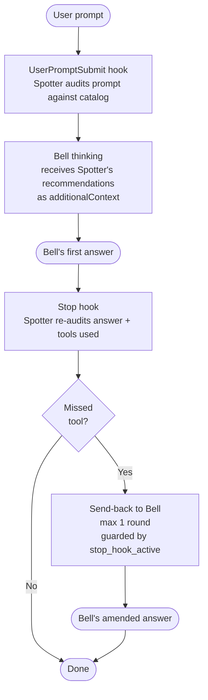
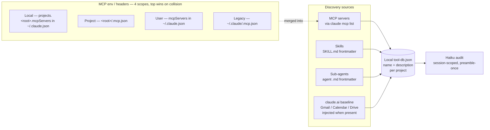

<p align="center">
  
</p>

# Spotter

[](https://www.npmjs.com/package/claude-spotter)
[](https://github.com/kitepon-rgb/Spotter/actions/workflows/ci.yml)
[](https://nodejs.org)
[](LICENSE)

**English · [日本語](README.ja.md)**

> **Separate the spotter from the doer.** Spotter runs alongside Claude Code and quietly flags the moments when Bell (your primary Claude) **forgets to use a tool it has access to**.

Claude has a structural blind spot: **it can't reach for a tool it doesn't realize it needs**. It may skip a project memory MCP when a decision should be recorded, answer from stale memory instead of a docs-lookup MCP, or reason about UI state without a browser-automation MCP. The model can't always tell when it doesn't know — so the tool stays unused.

Spotter pins a second agent (Claude Haiku 4.5) next to Bell. The second agent has the full tool catalog memorized and audits both the user's prompt and Bell's reply in parallel. When it spots a missed tool, it injects a transparent recommendation into Bell's context and, if needed, asks Bell to amend its answer. **Bell is never asked to self-audit** — that would defeat the entire premise. Detection happens through hooks, independent of Bell's intent.

## See it in 30 seconds

Examples of what Spotter catches:

| Situation | What Bell would do | What Spotter flags |
|---|---|---|
| "Please remember this OAuth gotcha" | Acknowledge and move on | Missed call to a memory / caveat MCP |
| "How does this package API work in the latest version?" | Answer from training-time knowledge | Missed call to a docs-lookup MCP |
| "Review this risky patch" | Self-review only | Missed call to a reviewer sub-agent |
| Asserting a fact | State it without verification | Opportunity to call a verification tool |
| "Does this UI still render correctly?" | Reason from source code alone | Missed call to a browser-automation MCP |
| "What did we decide about X earlier?" | Guess or admit forgetting | Missed call to a memory / notes MCP |

Spotter audits in two stages:

- **`stage=user_input`** — given the user's prompt, list any local catalog tools whose description clearly applies. A *prompt-fulfillment* check
- **`stage=turn_end`** — given Bell's final reply, look for places where a catalog tool (verification / recording / lookup) could plug in. A *missed-opportunity* audit. Zero findings is fine; tools already used in this turn are not re-flagged

## Install

```bash
npm install -g claude-spotter
cd your-project
spotter install
```

Since `v0.3.0`, Spotter requires **explicit per-project install** (the earlier `postinstall` auto-registration was the leading cause of orphan daemons). `spotter install` writes hooks into the project's `.claude/settings.json`; the audit is then active only in Claude Code sessions for that project.

After upgrading Spotter, re-run `spotter install` in each installed project when release notes mention hook setting changes. The global package update changes the code path, but existing `.claude/settings.json` timeout values are not rewritten automatically.

```bash
spotter uninstall        # remove hooks from this project
```

## Requirements

- **Node.js 22.5+**
- **Claude Code 2.0+**
- **Claude Max plan** (Spotter spawns Haiku via `claude -p`)

## Architecture

### Audit flow per turn



### Catalog discovery



The audited catalog lives in `<project>/.spotter/tool-db.json`. **The daemon audits against the local DB only**; the global DB at `~/.spotter/tool-db.json` is a description-reuse cache shared across projects, not an audit source. Each project's local DB always matches the **current** discovery snapshot for that project (stale entries are pruned on refresh), so tools installed in *other* projects can never bleed into this project's audit.

**`spotter install` seeds the catalog automatically, and the SessionStart hook runs a background `spotter db refresh` on every Claude Code session start** — so you don't need to invoke catalog commands by hand. Each MCP server's `tools/list` is fetched via JSON-RPC (HTTP / SSE / stdio transports supported); skill and sub-agent metadata comes straight from frontmatter; the claude.ai baseline (25 hand-curated entries for Gmail / Calendar / Drive over OAuth proxy) is injected only when `claude mcp list` confirms the server is present. **You never have to maintain the tool list by hand.**

## Spotter and Throughline

[Throughline](https://github.com/kitepon-rgb/Throughline) is a sibling project from the same author. Different mechanism, **shared philosophy**.

|  | Throughline | Spotter |
|---|---|---|
| Direction | Subtraction — evict what isn't needed | Addition — surface what's missing |
| Target | Context bloat | Missed tool calls |
| Mechanism | Hook-driven memory eviction | Hook-driven sub-agent in parallel |

Both share the principle of **"don't rely on the primary agent (Bell) to do it itself."** They compose well — you can run them together.

## Common commands

```bash
spotter db list          # show the current local tool-db (what the daemon actually audits against)
spotter db refresh       # rediscover MCP / skills / sub-agents and update the DB
                         #   (run automatically on install and on SessionStart since v1.1.0,
                         #    so this is rarely needed by hand)
spotter db rebuild       # wipe both local + global DBs and refresh from scratch
                         #   (use after catalog-shape changes)
spotter status           # list running daemons
spotter doctor           # environment check (Node / claude CLI / tool-db integrity)
spotter diagnostics logs # summarize daemon logs for pass=false / latency / anomaly signals
spotter codex risk-check --findings findings.json --host-agent claude
                         # run read-only codex-sidecar risk analysis for Spotter findings
spotter codex review|explore|opinion --findings findings.json --host-agent claude
                         # run other read-only codex-sidecar second-pass workflows
spotter codex work --findings findings.json --instruction "Update docs" --approve-work \
  --allowed-path docs/ --preserve-worktree
                         # run approved codex-sidecar work in an isolated worktree
spotter uninstall        # remove hooks from this project (leaves ~/.spotter intact)
```

Optional async Codex risk dispatch:

```bash
SPOTTER_CODEX_RISK_CHECK=1 spotter daemon start --session-id ... --project-root ...
```

When enabled, the daemon dispatches `pass:false` findings to `spotter codex risk-check`
in a detached process. Hook responses do not wait for Codex. Add
`SPOTTER_CODEX_RISK_CHECK_DRY_RUN=1` to exercise the wiring without calling Codex.

## Design docs

- **Current design** (catalog, discovery, classification axes): [docs/catalog-design.md](docs/catalog-design.md) — source of truth from v1.0.0
- **Open issues + unverified concerns**: [docs/open-issues.md](docs/open-issues.md) — read this before starting new work
- **Claude contract capture**: [docs/SPOTTER_CLAUDE_CONTRACT.md](docs/SPOTTER_CLAUDE_CONTRACT.md) — current hook / daemon / Haiku behavior that Codex work must preserve
- **Claude / Codex dual-support brief**: [docs/SPOTTER_CODEX_DUAL_SUPPORT.md](docs/SPOTTER_CODEX_DUAL_SUPPORT.md) and completed [TODO](docs/SPOTTER_CODEX_DUAL_SUPPORT_TODO.md) — second-pass `codex-sidecar` workflows
- **Primary auditor backend migration**: [docs/SPOTTER_PRIMARY_BACKEND_TODO.md](docs/SPOTTER_PRIMARY_BACKEND_TODO.md) — next plan for Codex CLI / `codex-sidecar` auditor backends
- **Implementation invariants (§0)**: [CLAUDE.md](CLAUDE.md) — no fallbacks, no silent failures, no provisional code
- **Historical record (v0.1 design discussion)**: [docs/spotter-plan.md](docs/spotter-plan.md) — frozen design-discussion snapshot

## Known limitations

- The `Stop` hook fires **after** Bell's first answer has already been streamed to the user. When Spotter sends Bell back, the user sees both the original answer and the corrected one. Detection accuracy in `UserPromptSubmit` (the *pre-response* stage) is therefore Spotter's primary axis of quality
- **Since v0.5.0, JSON schema violations from Haiku are treated as expected-anomalies** (silent pass + session renew, logged as `role_collapse_reset`) — this is the role-collapse recovery path. **Haiku timeouts still throw**, which surfaces as `UserPromptSubmit` blocking the user's prompt from reaching Bell. Timeouts have been raised twice (30s in v0.5.0, 45s in v0.13.1); making timeouts fail-open is deferred until §0 is revisited

<details>
<summary><strong>📋 Recent highlights</strong></summary>

- **Plugin-scoped MCP servers** — names like `plugin:everything-claude-code:context7` (with internal colons) are now parsed correctly and their tools enter the catalog. Earlier versions silently collapsed all plugin MCP servers into a single literal `"plugin"`, dropping their tools from Bell's audit
- **Per-project audit isolation** — the daemon audits against the local DB only; the global DB has been demoted to a description-reuse cache. Tools discovered in *other* projects can never bleed into this project's audit set
- **Zero-touch catalog** — `spotter install` seeds the tool DB automatically, and SessionStart triggers a background refresh. You never have to maintain the tool list by hand
- **Audit scope** — only user-added surface (MCP servers / skills / sub-agents). Claude Code's built-in tools are intentionally out of scope; Bell already uses those reliably
- **Implementation invariants** — no fallbacks, no silent failures, no provisional code (see [§0 in CLAUDE.md](CLAUDE.md))

Full release history: [CHANGELOG](CHANGELOG.md).

</details>

## License

MIT — see [LICENSE](LICENSE).
